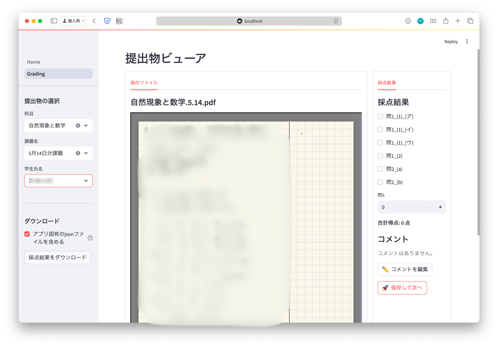

<h1 align="center">TA-assistant for PandA</h1>

> [!NOTE]
> PandA の課題を快適に採点するための Web アプリ。

- チェックボックスでのスムーズな採点
- 事前に定義した配点に基づく、得点の自動集計
- zip ファイルを使った PandA とのデータ連携



## 採点フロー

### 1. PandA から課題のデータをダウンロードする

- PandA の課題採点ページで「すべてダウンロード」を実行し、PC に課題のデータをダウンロードする。
- 成績ファイルの形式は CSV (`grades.csv`) を選択。

### 2. 課題データの登録、配点の定義

1. [localhost:8501](http://localhost:8501) にアクセスし、実行中のアプリをブラウザで開く。
2. PandA からダウンロードしたフォルダを zip に圧縮しておき、**Home** >「課題を追加する」のボタンからアップロードする。
3. `assignemts/科目名/課題名/allocation.json` というファイルを作成し、配点を定義する。
<details>
<summary>`allocation.json` の例：</summary>

```json
{
  "問1": {
    "(1)": {
      "(ア)": {
        "type": "full-or-zero",  # 部分点なし, チェックボックスでの採点
        "score": 10
      },
      "(イ)": {
        "type": "full-or-zero",
        "score": 10
      },
      "(ウ)": {
        "type": "full-or-zero",
        "score": 10
      }
    },
    "(2)": {
      "type": "full-or-zero",
      "score": 16
    }
  },
  "問2": {
    "type": "partial",  # 部分点あり. 点数の記入による numerical な採点
    "score": 32
  }
}
```

</details>

### 3. 課題の採点

### 4. 採点結果の圧縮、PandA への反映

- サイドバーの「採点結果をダウンロード」ボタンから、**JSON ファイルを含めずに**データをダウンロードする。
- PandA の課題採点ページに戻り、「すべてアップロード」から採点済みの zip ファイルをアップロードする（`grading_result_*.zip`）。

> [!IMPORTANT]
> zip ファイルをアップロードする際、PandA のオプション設定で **「受講者の提出テキスト」「受講者の提出物の添付」からチェックを外すこと。**
> （PandA にある添付ファイルを上書きしないようにするため）

## 起動方法

### 1. Python 環境の構築

[Streamlit](https://streamlit.io/) を含む Python 環境を作成する：

```shell
conda env create -f environment.yml
conda activate app-ta
```

### 2. Web アプリの実行

コマンドを実行し、ブラウザから [localhost:8501](http://localhost:8501) にアクセスする

```shell
streamlit run main.py
```

### 3. クラウド同期の設定 (optional)

アプリの [**Config**](http://localhost:8501/Config) から「課題データの保存先」をクラウド管理下のフォルダ（OneDrive, iCloud など）に設定することで、端末間でのデータ同期・バックアップが可能
